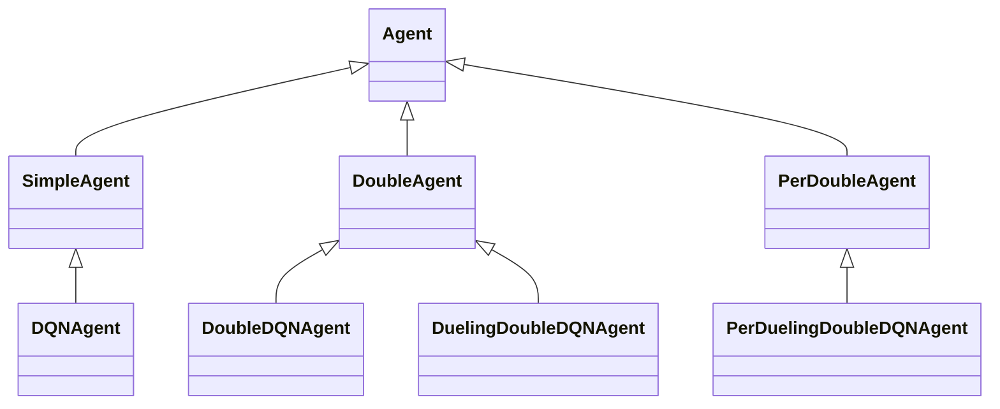
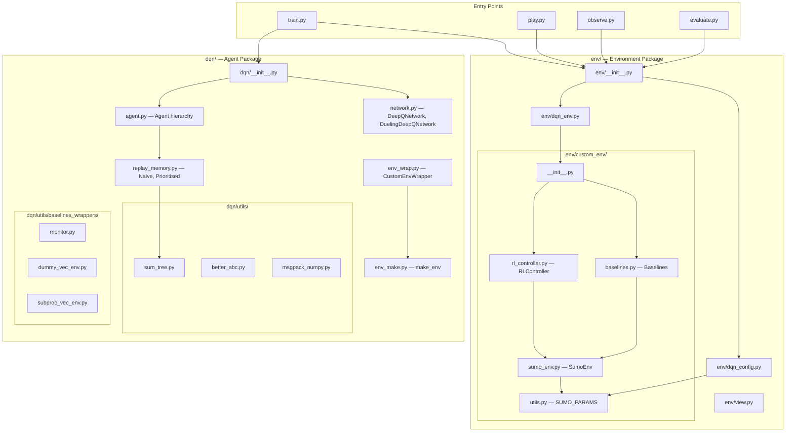
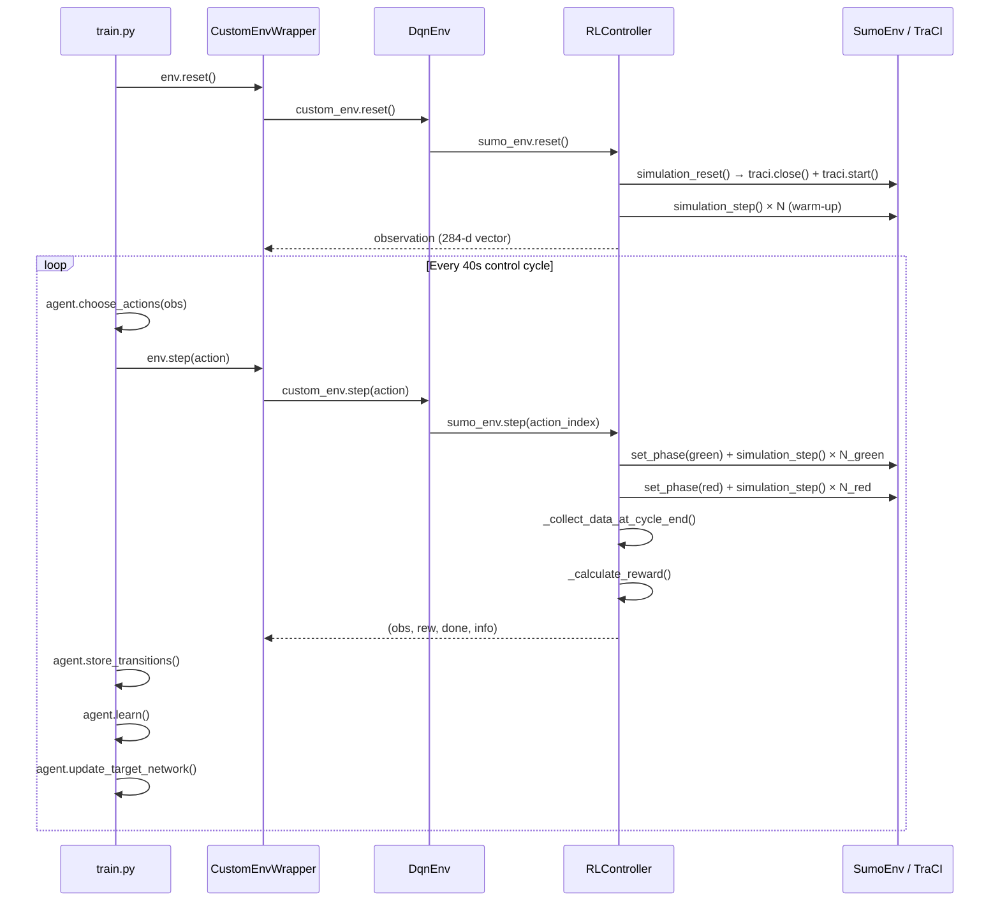

# Deep Reinforcement Learning for Automatic Ramp Metering Control — Technical Analysis

---

## 1. Project Goal

### 1.1 Problem Statement

Highway on-ramp merging zones are primary sites for traffic congestion. When the combined demand from the mainline and the on-ramp exceeds the downstream capacity, a **bottleneck** forms at the merge area: speeds collapse, throughput drops, and time-loss cascades upstream — the phenomenon known as **capacity drop**. Ramp metering — controlling the flow of vehicles entering the highway via a traffic signal at the on-ramp — is the most widely deployed countermeasure.

Traditional ramp metering algorithms (ALINEA, PI-ALINEA) are feedback controllers that regulate metering rates based on downstream occupancy. They require expert tuning of critical occupancy set-points and gain constants, and they do not inherently adapt to non-stationary demand patterns.

### 1.2 Motivation

This project investigates whether a **Deep Reinforcement Learning (DRL)** agent can learn a ramp metering policy that:

1. Maintains mainline free-flow speed at the merge and upstream.
2. Maximises downstream throughput.
3. Limits on-ramp queue length to prevent spillback onto the arterial network.

The agent observes traffic conditions via induction loops and (optionally) connected-vehicle data and decides the green-time allocation within a fixed-length control cycle.

### 1.3 Scope

- Single on-ramp, 3-lane mainline (`1ramp_1x3` network).
- Simulated via SUMO (Simulation of Urban MObility).
- Multiple state-representation variants explored (macro-only, macro+lane, hybrid macro+micro grid).
- Evaluated against four baselines: Always-Green, Fixed-Cycle, ALINEA, PI-ALINEA.

---

## 2. Environment Simulation

### 2.1 Simulation Tool

The project uses **SUMO v1.21** as the microscopic traffic simulator, interfaced through **TraCI** (Traffic Control Interface). The Python bindings `traci==1.21.0` and `sumolib==1.21.0` are used.

### 2.2 Network Topology

The network file `1ramp_1x3.net.xml` models a highway segment with:

| Element           | Edge ID              | Lanes | Notes                                         |
| ----------------- | -------------------- | ----- | --------------------------------------------- |
| Entry             | `entry`              | 3     | Upstream feed                                 |
| Off-ramp upstream | `off_ramp_up_stream` | 3     | Diverge point for off-ramp traffic            |
| Mainline          | `main_road`          | 3     | ~460 m segment upstream of merge              |
| On-ramp           | `on_ramp`            | 1     | ~204 m, metered by traffic light `ramp_meter` |
| Passage area      | `passage_area`       | 1     | Short link between ramp and merge             |
| Acceleration area | `acceleration_area`  | 4     | Merge zone (3 mainline + 1 auxiliary)         |
| Downstream        | `end_main_road`      | 3     | Exit segment                                  |

A traffic light `ramp_meter` with a two-phase program (`G` / `r`) gates vehicles at the on-ramp entry to the passage area.

### 2.3 Demand Generation

Route files are **generated dynamically** at each episode reset (`_generate_route_file()`). Flows are drawn from weighted discrete distributions:

```python
# From env/custom_env/utils.py (SUMO_PARAMS)
"veh_per_hour_main": [4000, 4500, 5000, 5500, 6000, 6500],
"veh_per_hour_on_ramp": [1400, 1500, 1600, 1700, 1800, 1900, 2000],
"veh_per_hour_off_ramp": [100, 300, 500],
```

Weights are biased towards higher demands to ensure the agent trains on congested scenarios. A connected-vehicle penetration rate is drawn uniformly from `[0.01, 0.99]`.

> [!note] Training vs. Evaluation Penetration
> In the active code inside `_generate_route_file()`, the penetration rate is **not actually applied to split flows** — nearly all vehicles are spawned as type `con` (connected). The commented-out code that correctly splits `main_flow * pen_rate` vs `main_flow * (1 - pen_rate)` is inactive. This is a significant discrepancy documented in Section 9.

### 2.4 Episode Structure

| Parameter                   | Value                                                                                         |
| --------------------------- | --------------------------------------------------------------------------------------------- |
| Episode length (sim time)   | 3600 s (1 hour)                                                                               |
| Agent control cycle         | 40 s                                                                                          |
| Max agent steps per episode | `max_episode_steps = 1000` (but episode terminates at 3600 s, yielding ~90 steps)             |
| Reset behaviour             | SUMO is fully restarted (`traci.close()` then `traci.start()`), a new route file is generated |
| Initial warm-up             | ~5 s of simulation before first observation                                                   |

### 2.5 State Space

The project has explored three state representations (stored as variant folders under `env/custom_env/`):

#### Variant 1: Macro-Only No Lane (`observation_space_n = 8`)

A flat vector of 8 normalised scalar features derived from induction loop data aggregated across all lanes at each measurement section:

| Index | Feature                  | Normalisation             |
| ----- | ------------------------ | ------------------------- |
| 0     | Upstream flow (veh/h)    | `/ MAX_FLOW_UPSTREAM_VPH` |
| 1     | Merge-area flow (veh/h)  | `/ MAX_FLOW_MERGING_VPH`  |
| 2     | Upstream occupancy (%)   | `/ 100`                   |
| 3     | Upstream speed (m/s)     | `/ FREEFLOW_SPEED_MPS`    |
| 4     | Bottleneck occupancy (%) | `/ 100`                   |
| 5     | Bottleneck speed (m/s)   | `/ FREEFLOW_SPEED_MPS`    |
| 6     | Ramp queue (veh)         | `/ MAX_RAMP_QUEUE_VEH`    |
| 7     | Last action (s)          | `/ CYCLE_DURATION_SEC`    |

Network: Standard MLP `[256, 128]`.

#### Variant 2: Macro With Lane (`observation_space_n = 14`)

Extends Variant 1 by adding per-lane metrics for lane 0 (the rightmost/auxiliary lane closest to the merge):

| Additional Indices | Feature                     |
| ------------------ | --------------------------- |
| 7                  | Lane-0 bottleneck flow      |
| 8                  | Lane-0 upstream flow        |
| 9                  | Lane-0 bottleneck occupancy |
| 10                 | Lane-0 bottleneck speed     |
| 11                 | Lane-0 upstream occupancy   |
| 12                 | Lane-0 upstream speed       |
| 13                 | Last action                 |

Network: Same MLP `[256, 128]` or the `TwoStreamHybridNetwork` depending on which `dqn_config.py` is active.

#### Variant 3: Hybrid Macro + Micro Grid (`observation_space_n = 14 + 27*5*2 = 284`)

The **active configuration** in the main branch. Combines the 14-element macro vector with a flattened micro-level spatial grid:

**Micro Grid Specification:**

| Parameter           | Value                                                               |
| ------------------- | ------------------------------------------------------------------- |
| Rows                | 27 (= 216 m / 8 m per cell)                                         |
| Columns             | 5 (3 mainline lanes + 1 accel/auxiliary lane + 1 ramp/passage lane) |
| Channels            | 2 (channel 0 = normalised speed, channel 1 = presence binary)       |
| Total grid features | 270                                                                 |
| Coverage            | 216 m communication range around the merge zone                     |

The grid is populated by subscribing to individual connected vehicles (`v_type = "con"`) via TraCI and mapping their position onto a spatial cell using edge-specific offset calculations. Column assignment follows a static map:

```python
column_map = {
    'main_road_2': 0, 'acceleration_area_3': 0,
    'main_road_1': 1, 'acceleration_area_2': 1,
    'main_road_0': 2, 'acceleration_area_1': 2,
    'acceleration_area_0': 3,
    'on_ramp_0': 4, 'passage_area_0': 4
}
```

Row index is computed as distance from the downstream end of the grid coverage area, discretised into 8 m cells.

**Combined state:** `np.concatenate((vector_state_14, flat_grid_270))` yielding a 284-dimensional flat vector passed to the `TwoStreamHybridNetwork`.

### 2.6 Action Space

Discrete action space with **8 actions**, each mapping to a green-time duration within the 40 s control cycle:

| Action Index | Green Time (s) | Red Time (s) |
| ------------ | -------------- | ------------ |
| 0            | 5              | 35           |
| 1            | 10             | 30           |
| 2            | 15             | 25           |
| 3            | 20             | 20           |
| 4            | 25             | 15           |
| 5            | 30             | 10           |
| 6            | 35             | 5            |
| 7            | 40             | 0            |

During a step, the agent's chosen green time is applied first (ramp signal set to green), then the remaining time is red. Multiple SUMO simulation steps are executed within each phase, aggregating queue and detector data.

### 2.7 Reward Function

The reward is a **weighted linear combination** of normalised positive rewards and negative penalties:

```python
def _calculate_reward(self):
    # (+) Speed rewards — higher is better
    w_speed_merge = 1.5    # Merge area speed
    w_speed_up = 1.0       # Upstream speed
    w_speed_down = 0.5     # Downstream speed

    # (-) Occupancy and queue penalties
    w_occ_bottle = 2.0     # Bottleneck occupancy
    w_occ_upstream = 1.0   # Upstream occupancy
    w_queue = 1.0          # Ramp queue length
    w_spillback = 20.0     # Spillback penalty (triggers at 90% of max queue)

    reward = (w_speed_merge * r_speed_merge +
              w_speed_up * r_speed_up +
              w_speed_down * r_speed_down +
              w_occ_bottle * p_occ_bottle +       # negative
              w_occ_upstream * p_occ_upstream +    # negative
              w_queue * p_queue +                  # negative
              w_spillback * p_spillback)           # negative, graded
```

**Component details:**

| Component     | Formula                                                                                   | Range   |
| ------------- | ----------------------------------------------------------------------------------------- | ------- |
| `r_speed_*`   | `clip(speed / freeflow_speed, 0, 1)`                                                      | [0, 1]  |
| `p_occ_*`     | `-1.0 * clip(occ / 100, 0, 1)`                                                            | [-1, 0] |
| `p_queue`     | `-1.0 * clip(queue / MAX_QUEUE, 0, 1)`                                                    | [-1, 0] |
| `p_spillback` | `-1.0 * clip((queue - 0.9*MAX) / (MAX - 0.9*MAX), 0, 1)` if queue > 90% threshold, else 0 | [-1, 0] |

The theoretical reward range is approximately **[-24, +3]**, heavily penalising spillback conditions.

### 2.8 Induction Loop Detectors

Defined in `1ramp_1x3.add.xml`, all with a 40 s collection period:

| Group      | IDs                        | Location                                 |
| ---------- | -------------------------- | ---------------------------------------- |
| Upstream   | `up_stream_sens_0/1/2`     | `main_road` lanes 0-2, pos ~453 m        |
| Bottleneck | `bottle_neck_sens_0/1/2/3` | `acceleration_area` lanes 0-3, pos ~59 m |
| Downstream | `outflow_sens_0/1/2`       | `end_main_road` lanes 0-2, pos ~7 m      |
| Ramp queue | `queue_sens`               | `on_ramp_0`, pos ~6 m                    |

---

## 3. Agent Model(s)

### 3.1 Agent Hierarchy

The agent architecture uses an inheritance hierarchy defined in [dqn/agent.py](dqn/agent.py):



| Concrete Agent Class       | Algorithm                | Network               | Replay Buffer         |
| -------------------------- | ------------------------ | --------------------- | --------------------- |
| `DQNAgent`                 | Vanilla DQN              | `DeepQNetwork`        | Naive (uniform)       |
| `DoubleDQNAgent`           | Double DQN               | `DeepQNetwork`        | Naive                 |
| `DuelingDoubleDQNAgent`    | Dueling Double DQN       | `DuelingDeepQNetwork` | Naive                 |
| `PerDuelingDoubleDQNAgent` | PER + Dueling Double DQN | `DuelingDeepQNetwork` | Prioritised (SumTree) |

### 3.2 Network Architectures

#### Standard DQN / Double DQN (`DeepQNetwork`)

```
Input → net (configurable body) → fc_out(fc_out_dim → output_dim) → Q-values
```

#### Dueling DQN (`DuelingDeepQNetwork`)

```
Input → net (configurable body) ─┬─ fc_val (→ 1)      → V(s)
                                  └─ fc_adv (→ |A|)    → A(s,a)
                                      ↓
                                  Q(s,a) = V(s) + (A(s,a) - mean(A))
```

Action selection uses the **advantage stream only** (`argmax` over advantages), avoiding the offset of the value stream.

#### TwoStreamHybridNetwork (Active Configuration)

For the hybrid macro+micro state, a custom two-stream architecture processes the flat 284-d input:

```mermaid
graph TD
    X["Input (batch, 284)"] --> SPLIT
    SPLIT -->|"x[:, :14]"| MACRO["Macro Vector (14)"]
    SPLIT -->|"x[:, 14:]"| MICRO_FLAT["Micro Flat (270)"]
    MICRO_FLAT --> RESHAPE["Reshape to (batch, 2, 27, 5)"]
    RESHAPE --> CNN["CNN Stream"]
    CNN --> |Conv2d 32, 3x3, s1| R1[ELU]
    R1 --> |Conv2d 64, 3x3, s(2,1)| R2[ELU]
    R2 --> |Conv2d 64, 3x3, s(2,2)| R3[ELU]
    R3 --> FLAT["Flatten"]
    FLAT --> CAT["Concatenate"]
    MACRO --> CAT
    CAT --> FC1["Linear → 512, ELU"]
    FC1 --> FC2["Linear → 256, ELU"]
    FC2 --> OUT["fc_out_dim = 256"]
```

This body feeds into either the standard `fc_out` layer (DQN) or the `fc_val`/`fc_adv` split (Dueling DQN).

### 3.3 Algorithm Details

**Double DQN** (the primary algorithm variant used):

```python
# From DoubleAgent.learn()
# Action selection uses ONLINE network
targets_online_best_q_indices = online_network(new_obses).argmax(dim=1)
# Action evaluation uses TARGET network
targets_selected_q_values = gather(target_network(new_obses), targets_online_best_q_indices)
# TD target
targets = rewards + (1 - dones) * gamma * targets_selected_q_values
```

**PER variant** additionally:

- Weights the loss by importance-sampling weights `is_weights_t`.
- Updates priorities in the SumTree based on `|TD_error|`.
- Uses `reduction='none'` on the loss function to allow per-sample weighting.

---

## 4. Training Strategy

### 4.1 Hyperparameters

From [env/dqn_config.py](env/dqn_config.py) (active configuration):

| Parameter                | Value                   | Notes                                           |
| ------------------------ | ----------------------- | ----------------------------------------------- |
| Learning rate            | `1e-4`                  | Adam optimiser                                  |
| Discount factor (γ)      | `0.99`                  |                                                 |
| Epsilon start            | `1.0`                   | Full exploration initially                      |
| Epsilon min              | `0.01`                  |                                                 |
| Epsilon decay steps      | `2e6`                   | Exponential interpolation                       |
| Epsilon decay type       | Exponential             | `np.exp(np.interp(..., [log(1.0), log(0.01)]))` |
| Batch size               | `32`                    |                                                 |
| Min replay buffer size   | `100,000`               | Must be filled before learning begins           |
| Max replay buffer size   | `1,000,000`             |                                                 |
| Target update            | Soft (Polyak)           | `τ = 1e-3` per step                             |
| Loss function            | `SmoothL1Loss` (Huber)  |                                                 |
| Max total training steps | `2.1e6` agent steps     |                                                 |
| Algorithm                | `DuelingDoubleDQNAgent` |                                                 |

### 4.2 Training Loop

Defined in [train.py](train.py), the `Train` class:

1. **Buffer Warm-Up** (`init_replay_memory_buffer`): Fills the replay buffer to `min_buffer_size` (100k transitions) using random actions, transitioning to epsilon-greedy actions for the last `resume_step` steps if resuming.

2. **Main Loop** (`train_loop`): For each step:
   - Select action via epsilon-greedy (`choose_actions`)
   - Execute in environment (one 40 s control cycle in SUMO)
   - Store transition `(s, a, r, done, s')`
   - Sample mini-batch and perform one gradient step (`learn`)
   - Update target network (soft update every step)
   - Log metrics and save model periodically

3. **Termination**: After `max_total_steps` agent steps (2.1M).

### 4.3 Exploration Strategy

Epsilon-greedy with **exponential decay**:

```python
def epsilon(self):
    return np.exp(np.interp(
        self.step * self.n_env,
        [0, self.epsilon_decay],               # [0, 2e6]
        [np.log(self.epsilon_start), np.log(self.epsilon_min)]  # [0, log(0.01)]
    ))
```

This creates a curve that decays rapidly early in training and flattens near `epsilon_min = 0.01`.

### 4.4 Replay Buffer

**Naive (uniform)** for `DuelingDoubleDQNAgent`:

- Standard `deque(maxlen=1_000_000)`.
- Uniform random sampling of `batch_size` transitions.

**Prioritised** for `PerDuelingDoubleDQNAgent`:

- SumTree-based priority buffer.
- Priority = `(|TD_error| + ε)^α` with `α=0.6`, `ε=0.0001`.
- Importance-sampling correction with `β` annealed from `0.4` to `1.0` over `eps_dec` steps.

### 4.5 Model Persistence

Models are saved as **msgpack** files (not PyTorch native `.pt`). The format stores:

- All network parameters as NumPy arrays.
- Training step count, episode count, mean reward, mean episode length.

This enables resumable training via the `--load True` flag.

### 4.6 Logging

- **TensorBoard** logs: Average reward, average episode length, episode count — written to `./logs/train/1ramp_1x3/<algo>_lr<lr>/`.
- Console output via `colorama`.

---

## 5. Evaluation Methods

### 5.1 Evaluation Framework

The evaluation pipeline in [evaluate.py](evaluate.py):

1. Runs `N` episodes (default 50) for a given strategy.
2. Each episode uses a deterministic seed (`master_seed + episode_id`).
3. All strategies share the same seeds for fair comparison.
4. Results are aggregated into a single CSV per strategy.

### 5.2 Baselines

Defined in [env/custom_env/baselines.py](env/custom_env/baselines.py):

| Baseline              | Description                                           | Key Parameters                     |
| --------------------- | ----------------------------------------------------- | ---------------------------------- |
| `AlwaysGreenBaseline` | Ramp signal permanently green — no metering           | —                                  |
| `FixedCycleBaseline`  | Fixed 20 s green / 20 s red alternation               | `tg=20`, `tr=20`                   |
| `AlineaDsBaseline`    | ALINEA: proportional feedback on downstream occupancy | `O_crit=17%`, `K_R=60`, cycle=40 s |
| `PiAlineaDsBaseline`  | PI-ALINEA: proportional-integral feedback             | `K_P=60`, `K_I=10`, same cycle     |

All baselines operate at the SUMO simulation step level (not 40 s cycles), providing higher-resolution control. The ALINEA/PI-ALINEA variants recalculate metering rates every 40 s cycle based on bottleneck occupancy.

### 5.3 Metrics

Three data sources are parsed per episode:

**From `tripinfo.xml`** (via `parse_tripinfo_for_episode_stats`):

- Total throughput, travel time (mean/median/std), time loss, waiting time
- Per-route breakdowns (Mainline, On-Ramp, Off-Ramp)
- Emissions: CO₂, NOₓ, fuel consumption
- Teleported vehicles count

**From SUMO log** (via `parse_sumo_log`):

- Demand loaded vs. inserted (service rate)
- Emergency stops count

**From framework CSV log** (via `parse_framework_log`):

- Average flow/occupancy/speed at upstream, merge area, and downstream
- Average ramp queue length
- Total spillback time (seconds where queue > threshold)

### 5.4 Evaluation Output

Results CSVs are stored in `evaluation/results/`:

- `results_AlwaysGreenBaseline.csv`
- `results_AlineaDsBaseline.csv`
- `results_PiAlineaDsBaseline.csv`
- `results_DQNAgentHybridFull.csv` (and other agent variants)

Jupyter notebooks for visualisation:

- [evaluation/results/evaluatiom.ipynb](evaluation/results/evaluatiom.ipynb) — main comparison plots
- [evaluation/results/sensitivity test.ipynb](evaluation/results/sensitivity%20test.ipynb) — sensitivity analysis
- [evaluation/reward/reward.ipynb](evaluation/reward/reward.ipynb) — training reward curves

---

## 6. Results

### 6.1 Trained Models

The repository contains models for two agent variants:

- `DuelingDoubleDQNAgent_lr0.0001` (saved in `save/1ramp_1x3/`)
- `PerDuelingDoubleDQNAgent_lr0.0001`

TensorBoard event files are present under `logs/train/` and `env/custom_env/micro + macro lane/`, indicating training runs were completed for the hybrid architecture.

### 6.2 Evaluated Configurations

Based on the results CSV filenames, the following agent configurations were evaluated:

| Config                     | State Rep.     | Description                                 |
| -------------------------- | -------------- | ------------------------------------------- |
| `DQNAgentMacroNoLaneOld`   | 8-d vector     | Macro-only, no lane-specific features       |
| `DQNAgentMacroNoLaneNew`   | 8-d vector     | Updated reward/training                     |
| `DQNAgentMacroLane`        | 14-d vector    | Macro with lane-level features              |
| `DQNAgentHybridPartial`    | 284-d (14+270) | Hybrid with low pen. rate (partial CV data) |
| `DQNAgentHybridPartialPer` | 284-d          | Hybrid with PER replay buffer               |
| `DQNAgentHybridFull`       | 284-d          | Hybrid with high pen. rate (~100% CV)       |

### 6.3 Plots

Generated plots are stored in `evaluation/results/plots/` covering:

- **Overall comparison** — bar charts across all strategies
- **Distribution analysis** — histograms and box plots of key metrics
- **Improvement matrices** — pairwise strategy comparisons
- **Scenario analysis** — performance under different demand levels

---

## 7. Technology Stack

### 7.1 Core Dependencies

| Library     | Version | Role                     |
| ----------- | ------- | ------------------------ |
| Python      | 3.7.12  | Runtime                  |
| PyTorch     | 1.13.1  | Neural network training  |
| SUMO        | 1.21.0  | Traffic micro-simulation |
| TraCI       | 1.21.0  | SUMO control interface   |
| Gymnasium   | 0.28.1  | Env wrapper API          |
| NumPy       | 1.21.6  | Numerical operations     |
| Pandas      | 1.3.5   | Data analysis            |
| TensorBoard | 2.11.2  | Training visualisation   |
| Matplotlib  | 3.5.3   | Plotting                 |
| Seaborn     | 0.12.2  | Statistical plots        |
| msgpack     | 1.0.2   | Model serialisation      |
| colorama    | 0.4.6   | Console output styling   |
| tqdm        | 4.64.1  | Progress bars            |

### 7.2 Environment Management

- Conda environment defined in [bin/environment.yml](bin/environment.yml).
- Environment name: `venv`.
- Originally developed on Linux (prefix `/home/youcef/miniconda3/envs/venv`).

### 7.3 Auxiliary Libraries

- `pyglet 1.5.0` — Optional Pyglet-based visualisation (disabled by default: `PYGLET = False`).
- `cloudpickle 2.2.1` — Used by baselines wrappers for process serialisation.
- `sumolib` — Network file parsing (`net.readNet()`).

---

## 8. Code Architecture

### 8.1 Module Structure



### 8.2 Key Files and Roles

| File                                                               | Responsibility                                                                                                                 |
| ------------------------------------------------------------------ | ------------------------------------------------------------------------------------------------------------------------------ |
| [train.py](train.py)                                               | Training entry point. Creates environment, agent, runs buffer warm-up and training loop.                                       |
| [play.py](play.py)                                                 | Runs a baseline strategy or human-playable mode. Inherits from `View`.                                                         |
| [observe.py](observe.py)                                           | Runs a trained DRL agent for evaluation/observation. Loads model and uses it for inference.                                    |
| [evaluate.py](evaluate.py)                                         | Batch evaluation script. Runs multiple episodes, parses outputs, saves results CSV.                                            |
| [env/dqn_config.py](env/dqn_config.py)                             | Central hyperparameter dictionary and `network_config()` function that defines the neural network body.                        |
| [env/dqn_env.py](env/dqn_env.py)                                   | `DqnEnv` — adapter between the framework's generic interface and the SUMO-specific `RLController`/`Baselines`.                 |
| [env/custom_env/sumo_env.py](env/custom_env/sumo_env.py)           | `SumoEnv` — base class handling all TraCI communication: start/stop/step, detector queries, route generation.                  |
| [env/custom_env/rl_controller.py](env/custom_env/rl_controller.py) | `RLController` — the RL environment logic: state construction, action execution, reward computation.                           |
| [env/custom_env/baselines.py](env/custom_env/baselines.py)         | Classical control baselines (Always-Green, Fixed-Cycle, ALINEA, PI-ALINEA).                                                    |
| [env/custom_env/utils.py](env/custom_env/utils.py)                 | `SUMO_PARAMS` — global configuration dictionary for the SUMO simulation.                                                       |
| [dqn/agent.py](dqn/agent.py)                                       | Agent class hierarchy: base `Agent`, learning variants (`SimpleAgent`, `DoubleAgent`, `PerDoubleAgent`), and concrete classes. |
| [dqn/network.py](dqn/network.py)                                   | PyTorch network definitions (`DeepQNetwork`, `DuelingDeepQNetwork`), save/load via msgpack.                                    |
| [dqn/replay_memory.py](dqn/replay_memory.py)                       | Replay buffers: `ReplayMemoryNaive` (uniform deque) and `ReplayMemoryPrioritized` (SumTree).                                   |
| [dqn/env_wrap.py](dqn/env_wrap.py)                                 | `CustomEnvWrapper` — Gymnasium-compatible wrapper providing `reset()→(obs, info)` and `step()→(obs, rew, term, trunc, info)`.  |
| [dqn/env_make.py](dqn/env_make.py)                                 | Environment factory: applies `RepeatActionWrapper`, `MaxEpisodeStepsWrapper`, and vectorised env wrappers.                     |
| [evaluation/parsers.py](evaluation/parsers.py)                     | Post-episode parsing of `tripinfo.xml`, SUMO logs, and framework CSV logs.                                                     |

### 8.3 Execution Flow



---

## 9. Identified Weaknesses and Gaps

### 9.1 Critical Issues

#### 9.1.1 Connected Vehicle Penetration Rate Not Applied During Training

In `SumoEnv._generate_route_file()`, the active code sets:

```python
main_con = int(main_flow - 1)
main_def = int(1)
```

This means **virtually all vehicles are spawned as connected** regardless of the drawn `pen_rate`. The correct implementation that splits by penetration rate is commented out:

```python
# main_con = int(main_flow * pen_rate)
# main_def = int(main_flow * (1 - pen_rate))
```

This means the micro grid is always fully populated during training, but during real deployment (or if the penetration-rate-aware code is activated for evaluation), the agent sees a degraded grid it was never trained on. The evaluation results named `HybridPartial` suggest some runs were done with partial penetration, but it is unclear whether the model was retrained or just evaluated on unseen conditions.

#### 9.1.2 Observation Computed Twice Per Step

In `RLController`, the `step()` method computes `_get_current_observation()` and `_calculate_reward()` to build its return tuple. However, `CustomEnvWrapper.step()` then calls `self._obs()` and `self._rew()` which call `DqnEnv.obs()` → `RLController.obs()` → `_get_current_observation()` **again**, and similarly for reward. This results in redundant computation of the observation (including the grid) and reward on every step.

#### 9.1.3 Queue Measurement: Vehicle Count Not Queue Length

`get_edge_ls_queue_length_vehicles()` actually calls `traci.edge.getLastStepVehicleNumber()`, which returns the **total number of vehicles on the edge**, not the number of queued/halting vehicles. SUMO provides `traci.edge.getLastStepHaltingNumber()` for actual queue measurement. This could overestimate the queue metric.

### 9.2 Design Concerns

#### 9.2.1 No Yellow Phase

The ramp meter transitions directly from green to red (and vice versa) with no yellow phase, despite `self.ty = 3` being defined but never used. While some ramp meters do operate without yellow in practice, including it would be more realistic.

#### 9.2.2 Hard-Coded Detector IDs

Detector IDs are string literals scattered across `RLController` and `BaselineMeta`:

```python
self.upstream_detector_ids_state = ["up_stream_sens_0", "up_stream_sens_1", "up_stream_sens_2"]
```

If the network configuration changes, these must be manually updated. They should be derived from the network file or from `SUMO_PARAMS`.

#### 9.2.3 Hard-Coded Edge IDs

Similarly, edge IDs are hard-coded in `SumoEnv`:

```python
self.UPSTREAM_EDGE = "main_road"
self.MERGING_EDGE = "acceleration_area"
```

This prevents the code from working with different network topologies without modification.

#### 9.2.4 No Gradient Clipping

None of the `learn()` methods apply gradient clipping (`torch.nn.utils.clip_grad_norm_` or `clip_grad_value_`). For DQN variants, gradient clipping is a standard stabilisation technique. Combined with the potentially large reward range ([-24, +3]), gradients could be unstable during early training.

#### 9.2.5 Single Environment (n_env=1) with Vectorised Wrapper Overhead

The code supports multi-environment vectorisation (`SubprocVecEnv`), but SUMO sessions cannot easily be parallelised due to port/socket conflicts. `n_env` is always 1, yet the code still wraps everything in `DummyVecEnv`, adding unnecessary overhead and requiring observations to be handled as lists.

#### 9.2.6 Python 3.7 Environment

The Conda environment specifies Python 3.7.12, which is end-of-life. PyTorch 1.13.1 is also no longer maintained. Upgrading to Python 3.10+ and PyTorch 2.x would provide access to modern features and performance improvements.

### 9.3 Architectural Gaps

#### 9.3.1 No Curriculum or Demand Scheduling

All demand scenarios are drawn randomly with fixed weights each episode. There is no curriculum learning strategy (e.g., starting with low demand and progressively increasing). The weighted distribution biases towards higher flows, but a structured curriculum could accelerate convergence.

#### 9.3.2 No Validation During Training

Training runs do not periodically evaluate the agent on a held-out set of deterministic scenarios. Performance is only tracked via the noisy running average of episode rewards.

#### 9.3.3 Model Variants Managed by File Replacement

The README states:

> To test other DRL Models you replace the content of the files (rl_controller and dqn_config [...]) with each corresponding files existing in the subfolders in custom_env/

This is fragile and error-prone. A proper configuration system (CLI flags, config files, or a registry pattern) should replace manual file swapping.

#### 9.3.4 No Automated Tests

There are no unit tests or integration tests. Given the complexity of the state construction, reward computation, and SUMO interaction, automated testing would significantly improve reliability.

#### 9.3.5 Off-Ramp Not Utilised in State

The network includes an off-ramp (`off_ramp_up_stream`, `off_ramp`), but the agent's state does not include any off-ramp metrics. Off-ramp flow affects mainline occupancy upstream of the merge and could provide useful signal.

### 9.4 Minor Issues

| Issue                                           | Location                              | Description                                                                                                                                                                                                                                     |
| ----------------------------------------------- | ------------------------------------- | ----------------------------------------------------------------------------------------------------------------------------------------------------------------------------------------------------------------------------------------------- |
| Typo in filename                                | `evaluation/results/evaluatiom.ipynb` | Should be `evaluation.ipynb`                                                                                                                                                                                                                    |
| Unused variable `self.ty`                       | `rl_controller.py`                    | Yellow time defined but never used                                                                                                                                                                                                              |
| `_reset_cycle_aggregators` creates unused lists | `rl_controller.py`                    | `list_interval_upstream_occ`, etc. are initialized but never populated — data is fetched directly from loop API                                                                                                                                 |
| `SUMO_HOME` hard-coded                          | `sumo_env.py`                         | `SUMO_HOME = "../sumo/"` — should use `os.environ["SUMO_HOME"]`                                                                                                                                                                                 |
| `env.step()` returns 4 values in `train.py`     | `train.py` line ~80                   | `new_obses, rews, dones, _ = self.env.step(actions)` — this uses old Gym API (4 values) while `CustomEnvWrapper.step()` returns 5 (new Gymnasium API). The `DummyVecEnv` wrapper likely reconciles this, but it creates a brittle API boundary. |
| Magic numbers in normalisation                  | `rl_controller.py`                    | `MAX_FLOW_UPSTREAM_VPH = 5490`, `MAX_RAMP_QUEUE_VEH = 25` — these should be derived from the network or documented with their derivation.                                                                                                       |

---

## 10. Summary Table: Key Design Decisions

| Decision             | Choice Made                      | Alternatives to Consider                    |
| -------------------- | -------------------------------- | ------------------------------------------- |
| Algorithm            | Dueling Double DQN               | PPO, SAC, TD3 (continuous action space)     |
| State representation | Flat vector (macro + micro grid) | Image-based CNN-only, Graph Neural Networks |
| Action space         | 8 discrete green-time durations  | Continuous green time, delta-based actions  |
| Control cycle        | Fixed 40 s                       | Adaptive cycle length, event-triggered      |
| Reward shaping       | Weighted multi-objective         | Constrained RL, lexicographic objectives    |
| Replay buffer        | Uniform / PER                    | Hindsight Experience Replay, n-step returns |
| Target update        | Soft (Polyak, τ=1e-3)            | Hard update every N steps                   |
| Simulator            | SUMO (microscopic)               | METANET (macroscopic), AIMSUN, Vissim       |

---

> [!warning] Action Before Extension
> Before extending this project, the following preparatory steps are recommended:
>
> 1. Fix the penetration rate bug in `_generate_route_file()`.
> 2. Fix the queue measurement to use `getLastStepHaltingNumber()`.
> 3. Eliminate the double computation of observation and reward.
> 4. Introduce a configuration system to replace file-swapping for model variants.
> 5. Add gradient clipping to all `learn()` methods.
> 6. Upgrade the Python/PyTorch versions.
